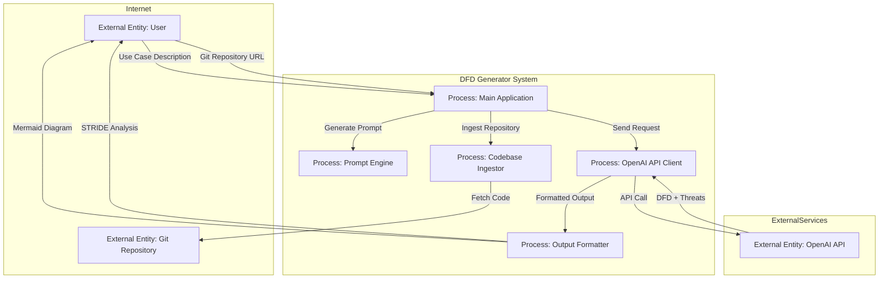

# DFD Generator with Threat Analysis

A Python-based tool that generates Data Flow Diagrams (DFDs) with integrated STRIDE threat modeling for cybersecurity analysis. This tool uses OpenAI's GPT-4o-mini model to automatically create structured DFDs and identify potential security threats in system architectures.

## 🚀 Features

- **Automated DFD Generation**: Creates comprehensive Data Flow Diagrams using Mermaid syntax
- **STRIDE Threat Analysis**: Identifies security threats using the STRIDE methodology:
  - **S**poofing
  - **T**ampering
  - **R**epudiation
  - **I**nformation Disclosure
  - **D**enial of Service
  - **E**levation of Privilege
- **Codebase Integration**: Automatically ingests and analyzes Git repositories for enhanced threat modeling
- **Tool Calling Support**: Uses OpenAI function calling to dynamically fetch codebase architecture
- **Trust Boundary Visualization**: Clearly separates external entities from internal systems
- **Dual Interface**: Both Jupyter notebook and Python script execution modes
- **Mermaid Integration**: Generates diagrams compatible with Mermaid visualization tools

## 📋 Prerequisites

- Python 3.7+
- OpenAI API key
- Required Python packages (see Installation section)

## 🛠️ Installation

1. **Clone the repository**
   ```bash
   git clone <repository-url>
   cd mini-project-1
   ```

2. **Install dependencies**
   ```bash
   # Using requirements.txt (recommended)
   pip install -r requirements.txt
   
   # Or install individually
   pip install openai python-dotenv beautifulsoup4 requests ipython gitingest
   ```

3. **Set up environment variables**
   ```bash
   # Create a .env file in the project root
   echo "OPENAI_API_KEY=your_openai_api_key_here" > .env
   ```

4. **Verify API key**
   - Ensure your OpenAI API key starts with `sk-proj-` and is longer than 10 characters
   - The tool will validate the API key format on startup

## 🚀 Usage

### Method 1: Python Script Execution

1. **Run the main script directly**:
   ```bash
   python main.py
   ```

2. **Enter your use case with a Git repository URL** when prompted, for example:
   ```
   We want a DFD Generator tool that creates Data Flow Diagrams with STRIDE threat analysis. The system should accept use case descriptions from users, optionally analyze Git repositories for codebase structure, and generate Mermaid diagrams with security threat analysis. The tool should integrate with OpenAI's GPT-4o-mini model and support both Jupyter notebook and Python script interfaces. Security considerations should include protecting API keys, validating inputs, and ensuring secure codebase analysis.

     https://github.com/your-username/repo
  
   - Press Enter to skip if you don't have a repository
   - The system will analyze the codebase if a valid URL is provided
   ```

3. **The system will automatically**:
   - Generate a DFD using your use case description
   - Ingest and analyze the Git repository (if provided)
   - Display the Mermaid diagram code
   - Show the STRIDE threat analysis table

### Method 2: Jupyter Notebook

1. **Start Jupyter Notebook**
   ```bash
   jupyter notebook DFD_generator.ipynb
   ```

2. **Execute cells in order**:
   - Cell 0-1: Import libraries and set up the system
   - Cell 2-3: Define system prompts
   - Cell 4-5: Define user input function
   - Cell 6-7: Prepare messages for OpenAI API
   - Cell 8-9: Generate DFD and threat analysis
   - Cell 10-11: Display results

### Codebase Integration

The tool now supports automatic codebase analysis:

1. **When prompted for a Git repository URL**, provide a valid GitHub/GitLab URL
2. **Supported repository formats**:
   - `https://github.com/username/repository`
   - `https://gitlab.com/username/repository`
   
3. **The system will automatically**:
   - Ingest the repository structure
   - Analyze the codebase architecture
   - Incorporate findings into the DFD generation
   - Provide more accurate threat analysis based on actual code structure
4. **If no repository is provided**, the system will generate a DFD based solely on your use case description

### Visualizing Diagrams

- Use the generated Mermaid code with [Eraser.io Mermaid Diagram Maker](https://www.eraser.io/make/free-mermaid-diagram-maker)
- Or integrate with any Mermaid-compatible tool

## 📊 Output Format

The tool generates two main outputs:

### 1. Mermaid DFD Diagram


### 2. STRIDE Threat Analysis Table
| Element | STRIDE Category | Threat Description | Mitigation |
|---------|----------------|-------------------|------------|
| User | Spoofing | Attacker impersonates user to access system | Implement API key authentication |
| MainApp | Tampering | Malicious use case input could exploit system | Input validation and sanitization |
| OpenAI API | Information Disclosure | Sensitive data in API requests | Use secure API endpoints, encrypt data |
| IngestEngine | Denial of Service | Malicious Git URLs could cause system overload | URL validation and rate limiting |
| GitRepo | Repudiation | Repository access could be denied | Implement logging and audit trails |
| OpenAIService | Elevation of Privilege | API key compromise could grant unauthorized access | Secure key storage and rotation |

## 🔧 Configuration

### Model Settings
- **Model**: `gpt-4o-mini` (configurable in Cell 1)
- **Temperature**: `0.2` (for consistent outputs)
- **Max Tokens**: `1500` (adjustable based on complexity)

### System Prompt Customization

- Change threat modeling methodology
- Adjust output format requirements
- Modify trust boundary definitions

## 🏗️ Architecture

### Project Structure
```
DFD-gen/
├── main.py                 # Main execution script with tool calling
├── prompts.py              # System and user prompt templates
├── ingst.py                # Codebase ingestion functionality
├── DFD_generator.ipynb     # Jupyter notebook interface
└── README.md               # Project documentation
```

### Component Overview

**main.py**
- Main execution script with OpenAI integration
- Tool calling functionality for codebase ingestion
- Handles both simple use cases and repository analysis
- Output formatting and display

**prompts.py**
- System prompt for DFD generation and threat analysis
- User prompt template with use case formatting
- STRIDE methodology integration

**ingst.py(tool)**
- Git repository ingestion using gitingest library
- Codebase tree structure extraction
- File filtering and exclusion patterns

**DFD_generator.ipynb**
- Interactive Jupyter notebook interface
- Step-by-step execution cells
- Visual output display with Markdown rendering

## 🔒 Security Considerations

- **API Key Protection**: Store OpenAI API keys in `.env` files (never commit to version control)
- **Input Validation**: The tool validates API key format before processing
- **Rate Limiting**: Consider implementing rate limiting for production use
- **Output Sanitization**: Review generated content before implementation

## 🧪 Testing

### Manual Testing
1. Test with various use case descriptions
2. Verify Mermaid syntax validity
3. Check STRIDE analysis completeness
4. Validate trust boundary accuracy

### Example Test Cases
- E-commerce platform
- Healthcare booking system  
- Warehouse management system
- Mobile food delivery app
- Banking application with Git repository analysis
- Microservices architecture with multiple repositories

## 📈 Performance

- **Response Time**: ~2-5 seconds per generation (simple use cases)
- **Response Time**: ~5-15 seconds per generation (with codebase analysis)
- **Token Usage**: ~500-1000 tokens per request (simple)
- **Token Usage**: ~1000-3000 tokens per request (with repository analysis)
- **Cost**: ~$0.001-0.002 per generation (simple, using gpt-4o-mini)
- **Cost**: ~$0.002-0.006 per generation (with codebase analysis)

## 🤝 Contributing

1. Fork the repository
2. Create a feature branch (`git checkout -b feature/amazing-feature`)
3. Commit your changes (`git commit -m 'Add some amazing feature'`)
4. Push to the branch (`git push origin feature/amazing-feature`)
5. Open a Pull Request


## 🆘 Troubleshooting

### Common Issues

1. **API Key Error**
   - Ensure your OpenAI API key is correctly set in the `.env` file
   - Verify the key starts with `sk-proj-` and is longer than 10 characters

2. **Import Errors**
   - Install all required dependencies: `pip install -r requirements.txt`
   - Ensure you're using Python 3.7+
   - If gitingest installation fails, try: `pip install --upgrade pip` first

3. **Empty Output**
   - Check your internet connection
   - Verify OpenAI API credits are available
   - Try reducing the complexity of your use case description

### Getting Help

- Review OpenAI API documentation
- Consult Mermaid diagram syntax guide

## 🔮 Future Enhancements

- [x] Git repository integration and codebase analysis
- [x] Tool calling functionality for dynamic data fetching
- [x] Modular codebase structure with separate components
- [ ] Support for PlantUML output format
- [ ] Batch processing for multiple use cases
- [ ] Custom threat modeling frameworks
- [ ] Integration with popular diagramming tools
- [ ] Export to various formats (PNG, SVG, PDF)
- [ ] Web-based interface
- [ ] Threat severity scoring
- [ ] Mitigation recommendation engine
- [ ] Support for private repositories with authentication
- [ ] Real-time codebase monitoring and threat updates

## 📚 References

- [STRIDE Threat Modeling](https://docs.microsoft.com/en-us/azure/security/develop/threat-modeling-tool-threats)
- [Mermaid Documentation](https://mermaid-js.github.io/mermaid/)
- [OpenAI API Documentation](https://platform.openai.com/docs)
- [Data Flow Diagram Standards](https://www.lucidchart.com/pages/data-flow-diagram)

---

**Note**: This tool is designed for educational and analysis purposes. Always review and validate generated security analyses with qualified security professionals before implementing in production systems.
