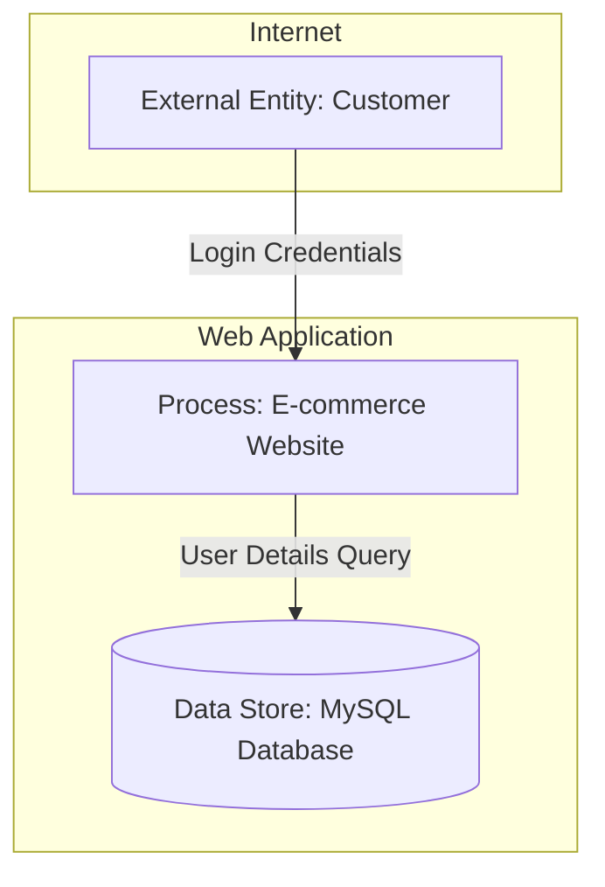

# DFD Generator with Threat Analysis

A Python-based tool that generates Data Flow Diagrams (DFDs) with integrated STRIDE threat modeling for cybersecurity analysis. This tool uses OpenAI's GPT-4o-mini model to automatically create structured DFDs and identify potential security threats in system architectures.

## 🚀 Features

- **Automated DFD Generation**: Creates comprehensive Data Flow Diagrams using Mermaid syntax
- **STRIDE Threat Analysis**: Identifies security threats using the STRIDE methodology:
  - **S**poofing
  - **T**ampering
  - **R**epudiation
  - **I**nformation Disclosure
  - **D**enial of Service
  - **E**levation of Privilege
- **Trust Boundary Visualization**: Clearly separates external entities from internal systems
- **Interactive Interface**: User-friendly input system for describing use cases
- **Mermaid Integration**: Generates diagrams compatible with Mermaid visualization tools

## 📋 Prerequisites

- Python 3.7+
- OpenAI API key
- Required Python packages (see Installation section)

## 🛠️ Installation

1. **Clone the repository**
   ```bash
   git clone <repository-url>
   cd mini-project-1
   ```

2. **Install dependencies**
   ```bash
   pip install openai python-dotenv beautifulsoup4 requests ipython
   ```

3. **Set up environment variables**
   ```bash
   # Create a .env file in the project root
   echo "OPENAI_API_KEY=your_openai_api_key_here" > .env
   ```

4. **Verify API key**
   - Ensure your OpenAI API key starts with `sk-proj-` and is longer than 10 characters
   - The tool will validate the API key format on startup

## 🚀 Usage

### Running the Jupyter Notebook

1. **Start Jupyter Notebook**
   ```bash
   jupyter notebook DFD_generator.ipynb
   ```

2. **Execute cells in order**:
   - Cell 0-3: Import libraries and set up the system
   - Cell 4-5: Define user input function
   - Cell 6-7: Prepare messages for OpenAI API
   - Cell 8-9: Generate DFD and threat analysis
   - Cell 10-11: Display results

### Interactive Usage

1. **Run the user prompt function**:
   ```python
   user_prompt_dfd()
   ```

2. **Enter your use case** when prompted, for example:
   ```
   We want a warehouse system to track incoming and outgoing goods. Staff should be able to update stock levels, and managers can view reports. The system should also connect to suppliers for reordering. Security considerations should include preventing unauthorized changes to inventory records, data leaks, or service disruption.
   ```

3. **View the generated DFD and threat analysis**

### Visualizing Diagrams

- Use the generated Mermaid code with [Eraser.io Mermaid Diagram Maker](https://www.eraser.io/make/free-mermaid-diagram-maker)
- Or integrate with any Mermaid-compatible tool

## 📊 Output Format

The tool generates two main outputs:

### 1. Mermaid DFD Diagram


### 2. STRIDE Threat Analysis Table
| Element | STRIDE Category | Threat Description | Mitigation |
|---------|----------------|-------------------|------------|
| User | Spoofing | Attacker impersonates user | Implement MFA |
| WebApp | Tampering | Data modification | Use encryption |

## 🔧 Configuration

### Model Settings
- **Model**: `gpt-4o-mini` (configurable in Cell 1)
- **Temperature**: `0.2` (for consistent outputs)
- **Max Tokens**: `1500` (adjustable based on complexity)

### System Prompt Customization
The system prompt can be modified in Cell 2 to:
- Change threat modeling methodology
- Adjust output format requirements
- Modify trust boundary definitions

## 🏗️ Architecture

```
DFD_generator.ipynb
├── Environment Setup (Cells 0-1)
├── System Configuration (Cells 2-3)
├── User Interface (Cells 4-5)
├── API Integration (Cells 6-7)
├── Generation Logic (Cells 8-9)
└── Output Processing (Cells 10-11)
```

## 🔒 Security Considerations

- **API Key Protection**: Store OpenAI API keys in `.env` files (never commit to version control)
- **Input Validation**: The tool validates API key format before processing
- **Rate Limiting**: Consider implementing rate limiting for production use
- **Output Sanitization**: Review generated content before implementation

## 🧪 Testing

### Manual Testing
1. Test with various use case descriptions
2. Verify Mermaid syntax validity
3. Check STRIDE analysis completeness
4. Validate trust boundary accuracy

### Example Test Cases
- E-commerce platform
- Healthcare booking system
- Warehouse management system
- Mobile food delivery app

## 📈 Performance

- **Response Time**: ~2-5 seconds per generation
- **Token Usage**: ~500-1000 tokens per request
- **Cost**: ~$0.001-0.002 per generation (using gpt-4o-mini)

## 🤝 Contributing

1. Fork the repository
2. Create a feature branch (`git checkout -b feature/amazing-feature`)
3. Commit your changes (`git commit -m 'Add some amazing feature'`)
4. Push to the branch (`git push origin feature/amazing-feature`)
5. Open a Pull Request


## 🆘 Troubleshooting

### Common Issues

1. **API Key Error**
   - Ensure your OpenAI API key is correctly set in the `.env` file
   - Verify the key starts with `sk-proj-` and is longer than 10 characters

2. **Import Errors**
   - Install all required dependencies: `pip install -r requirements.txt`
   - Ensure you're using Python 3.7+

3. **Empty Output**
   - Check your internet connection
   - Verify OpenAI API credits are available
   - Try reducing the complexity of your use case description

### Getting Help

- Review OpenAI API documentation
- Consult Mermaid diagram syntax guide

## 🔮 Future Enhancements

- [ ] Support for PlantUML output format
- [ ] Batch processing for multiple use cases
- [ ] Custom threat modeling frameworks
- [ ] Integration with popular diagramming tools
- [ ] Export to various formats (PNG, SVG, PDF)
- [ ] Web-based interface
- [ ] Threat severity scoring
- [ ] Mitigation recommendation engine

## 📚 References

- [STRIDE Threat Modeling](https://docs.microsoft.com/en-us/azure/security/develop/threat-modeling-tool-threats)
- [Mermaid Documentation](https://mermaid-js.github.io/mermaid/)
- [OpenAI API Documentation](https://platform.openai.com/docs)
- [Data Flow Diagram Standards](https://www.lucidchart.com/pages/data-flow-diagram)

---

**Note**: This tool is designed for educational and analysis purposes. Always review and validate generated security analyses with qualified security professionals before implementing in production systems.
